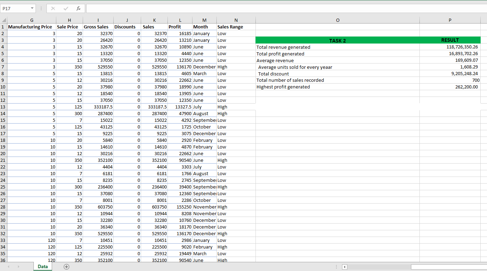

# Basic Excel Funtions and Formulas

## Introduction:

The report presents an analysis conducted using basic Excel functions to derive insights from sales data set

## Problem Statement:

The primary aim is to determine the following;

1. The total Revenue and Profit Generated: The total revenue and profit generated were determined using the SUM function in Excel.

2. The Average Revenue and Units Sold for every Order: Using the Average function, it's found that the average revenue and units sold per order are; $182,759.43, and 1,608.29, specifically.

3. The total discounts given in $. This was gotten using the Count function.

4. Total number of Sales Recorded: This was gotten using the Count function also.

5. The highest Profit generated: The highest profit value was determined using the MAX Function. 

Additionally, create a column named 'Sales Range', return 'High Sales if the sales value is above average, otherwise, return 'Low Sales'. This was determined using the IF Function.

The above snapshot shows the result of the problem statement.

## Conclusion:

The report aims to identify insights in the sales data through the use of basic excel functions and Fomulas Above is the screenshot of the values determined from the basic questions.

